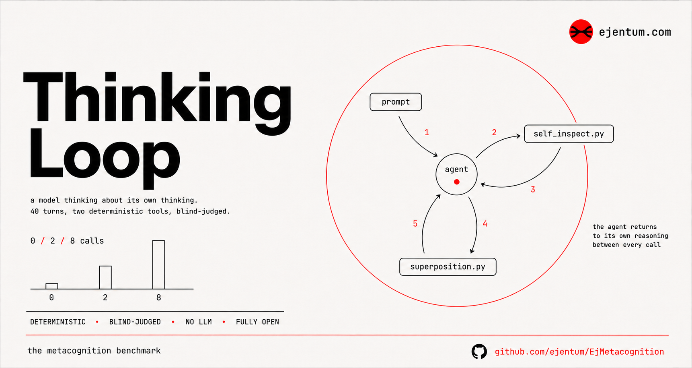

<p align="center">
  
</p>

# metacognition-bench

**What two deterministic metacognition tools do to a small model's reasoning over a long, stateful chain.**

This repository is a benchmark instrument and the raw, verifiable data from running it. It does not measure whether a model gets answers *right*. It measures what happens to a model's *thinking* when, every single turn for a long run, it is forced to (a) diverge from the frame it is already assuming and (b) answer one question that challenges an assumption it did not state.

The two instruments are deliberately dumb: two single-file Python programs, no LLM, no network, no key, deterministic. Given the same input they always return the same output. That property is what makes the runs in here *provable*: the full execution transcript is included, and `verify/verify_calls.py` re-runs every tool call on its recorded input and confirms the output the model received is exactly what the tool produces now. A run in this repo cannot have been faked.

> **Status: concluded.** ~13 runs (a small model and a frontier model, 40-turn open-ended reasoning, blind order-swapped judging, a 209-call corpus measurement). Findings below; full write-ups dated in [`observations/`](observations/), runs in [`runs/`](runs/), measurement in [`analysis/`](analysis/).

## Headline finding

**The tools do not make an agent reason better. They make its reasoning legible and checkable at the moments that matter, and they reward a metacognitive discipline they cannot create.**

- **Reliable and auditable (strong).** Both tools are deterministic, re-runnable, model-independent. Every call is a verifiable record of what the agent checked. This is the durable, defensible value, and almost no other agent tool can claim it.
- **Reasoning uplift is conditional, not automatic.** Forced on every step, the tools *lose to using no tools at all* in blind judging (35 turns to 5), because mandatory self-examination manufactures staged corrections that read worse than nothing. They help only when fired selectively, at a genuine wall, by a model capable of judging that it is stuck.
- **Dose-response: less is more.** On a frontier model, 2 self-chosen calls beat 0 tools beat a forced budget of 8. The peak is minimal, self-triggered use; forcing any cadence underperforms. A fixed ratio is the wrong control variable.
- **The deciding axis is genuine vs staged self-correction, and it is textually detectable.** A tool call helps when it forces a real redirect (a new distinction, plus a concrete counterexample, plus downstream dependence) and hurts when it stages one (overclaim, then a scheduled walk-back, then a recycled "breakthrough").
- **The shippable recipe:** selective and self-triggered, with a per-tool output-use recipe, on a model capable of telling a real wall from a manufactured one. Teaching that recipe produced the strongest run in the corpus.

**For an agentic stack:** adopt them as *governed checkpoints at genuine decision points on capable agents*, not as an ambient wrapper. Mandatory reflection loops are an anti-pattern that capable models route around or perform theatrically; this benchmark is a measurable instance of reflection done right.

## The two instruments

| Tool | Move | Input | Output |
|---|---|---|---|
| [`tools/superposition.py`](tools/superposition.py) | **divergence** | `{"task","description","wants"}` | a two-pole tension: two readings of what you are doing and a question about which is real |
| [`tools/self_inspect.py`](tools/self_inspect.py) | **doubt** | a thought | one *metathought*: a short question that turns attention onto an unstated assumption |

Both are deterministic, keyless, stdlib-only. Source repos: [self-inspect](https://github.com/ejentum/self-inspect-mcp) · superposition. The copies in [`tools/`](tools/) are the exact files used by the runs here.

## The loop

Each turn, the model (holding the whole prior thread in one continuous context) does:

1. **Claim** its current best position on the turn's question, building on every earlier turn.
2. **Superposition** (mandatory): build a rich `{task,description,wants}` from the claim, run the tool, name the pole it was *already* assuming, then develop the **other** pole and reframe the claim from it. Taking the other pole is a gate, not a suggestion.
3. **Self-inspect** (recursive): run the doubt tool on the reframed claim, answer the metathought honestly.
4. **Insight + advance**: one crisp insight, then a genuinely new next question.

Full design, the exact orchestration prompt, and the known limitations are in [`methodology.md`](methodology.md).

## Runs

| Run | Model | Turns | State | Tool calls | Verified |
|---|---|---|---|---|---|
| [`runs/stateful-haiku-40turn`](runs/stateful-haiku-40turn/) | Claude Haiku 4.5 | 40 | continuous (one context) | 40 superposition + 40 self-inspect | yes, 80/80 re-run identical |

Each run directory holds: the raw execution `transcript.jsonl` (ground truth), the model's self-reported `journal.jsonl`, a reconstructed verbatim `full_loop.jsonl` (every turn's tool input/output plus the model's reasoning), a human-readable `full_loop.md`, and the exact `orchestration_prompt.txt`.

## Reproduce the proof

```sh
python verify/verify_calls.py runs/stateful-haiku-40turn
# self_inspect  re-run == logged: 40 ok, 0 mismatch
# superposition re-run == logged: 40 ok, 0 mismatch
# RESULT: ALL CALLS VERIFIED
```

## What this is honest about

- It measures **process**, not correctness. The claim is auditability and what structured doubt plus forced divergence *do* to a reasoning chain, never that the model's philosophy is true.
- The model's text is reproduced **verbatim** (including its own style and any transcript encoding artifacts). The `.jsonl` is faithful; the `.md` is lightly cleaned for reading only.
- No metric is reported until the observation pass in [`observations/`](observations/) substantiates it from this data.

## License

MIT. See [`LICENSE`](LICENSE).
